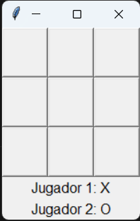
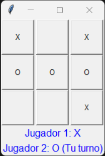
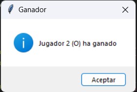

# Game


<figure style="text-align: center;">
  
  <figcaption><strong></strong></figcaption>
</figure>

## **Índice**
1. [**Descripción**](#descripción)
2. [**Instalación**](#instalación)
3. [**Herramientas Utilizadas**](#herramientas-utilizadas)
4. [**Uso**](#uso)
5. [**Estructura del Código**](#estructura-del-código)
6. [**Requisitos**](#requisitos)
7. [**Licencia**](#licencia)
8. [**Autor**](#autor)


## **Descripción**
Este código implementa un juego de Tres en Raya (Tic Tac Toe) utilizando la biblioteca Tkinter en Python. La aplicación crea una interfaz gráfica con una ventana que contiene un tablero 3x3, donde cada celda está representada por un botón. Los jugadores pueden hacer clic en los botones para colocar sus signos, alternando entre X y O en cada turno.

## **Instalación**

1. Asegúrate de tener **Python 3.12** o superior instalado en tu sistema.
2. Instala **Git** si aún no lo tienes.
3. Clona el repositorio desde GitHub con el siguiente comando:
   ```bash
    https://github.com/Mogollo7/Game.git    
    ```

## Herramientas Utilizadas

-  **Python**: El lenguaje de programación utilizado para desarrollar la aplicación, permitiendo la implementación de la lógica del juego y la interacción con la interfaz gráfica.

- **Tkinter**: Biblioteca estándar de Python para la creación de interfaces gráficas de usuario (GUI). Se utiliza para construir la ventana principal, botones y etiquetas del juego.

- **messagebox**: Un módulo de Tkinter que permite mostrar cuadros de mensaje emergentes, utilizados en este juego para notificar a los jugadores sobre ganadores y empates.

## **Uso**
Aquí tienes la sección de uso actualizada con el enlace a tu repositorio:


### Uso

1. **Clonar el Repositorio**: Clona el repositorio del juego utilizando el siguiente comando en tu terminal:

   ```bash
   git clone https://github.com/Mogollo7/Game.git
   ```

2. **Navegar a la Carpeta**: Entra en la carpeta del proyecto clonado:

   ```bash
   cd Game
   ```

3. **Ejecutar el Juego**: Inicia el archivo `game.py` con Python:

   ```bash
   python game.py
   ```

4. **Interacción**: Aparecerá una ventana con un tablero de 3x3. Los jugadores pueden hacer clic en las celdas vacías para colocar su signo (X o O), alternando turnos.

5. **Finalizar el Juego**: Al finalizar, se mostrará un cuadro de mensaje indicando el resultado. Para jugar de nuevo, simplemente vuelve a ejecutar el archivo `game.py`.

## **Estructura del Código**

<figure style="text-align: center;">
  
  <figcaption><strong></strong></figcaption>
</figure>

Aquí tienes una explicación superficial de cómo funciona el código del juego "Tres en Raya":

### Explicación General

El código implementa un juego de "Tres en Raya" (también conocido como "Tic Tac Toe") utilizando la biblioteca Tkinter en Python, que permite crear interfaces gráficas.

1. **Importación de Módulos**: Se importan los módulos necesarios para crear la ventana y manejar los cuadros de mensaje.

2. **Configuración de la Ventana**: Se inicializa la ventana principal del juego y se le asigna un título ("Tres en Raya").

3. **Inicialización de Variables**: 
   - `signo`: Lleva el conteo de los turnos para alternar entre los dos jugadores.
   - `tablero`: Se crea una matriz de 3x3 que representa el estado del juego, inicialmente llena de espacios vacíos.

4. **Creación de Botones**: 
   - Se generan botones para cada celda del tablero. Cada botón está vinculado a la función `obtener_texto`, que se activa al hacer clic.
   - Los botones se organizan en una cuadrícula dentro de la ventana.

5. **Etiquetas para Jugadores**: 
   - Se crean etiquetas para mostrar qué jugador está en turno y sus respectivos signos (X para el Jugador 1 y O para el Jugador 2).

6. **Funciones de Lógica del Juego**:
   - **`ganador(b, l)`**: Verifica si un jugador ha ganado, comprobando todas las combinaciones posibles de tres en línea (filas, columnas y diagonales).
   - **`obtener_texto(i, j, gb, l1, l2)`**: Maneja la lógica cuando un jugador hace clic en un botón. Actualiza el estado del tablero, cambia el texto del botón correspondiente y verifica si hay un ganador o si el juego termina en empate.
   - **`lleno()`**: Verifica si el tablero está completamente lleno, lo que indicaría un empate si no hay un ganador.

<figure style="text-align: center;">
  
  <figcaption><strong></strong></figcaption>
</figure>

7. **Ejecución del Juego**: La función `ventana.mainloop()` inicia el bucle principal de la aplicación, manteniendo la ventana abierta y respondiendo a las interacciones del usuario.

### Flujo del Juego
- Al inicio, la ventana se abre con un tablero vacío.
- Los jugadores alternan turnos haciendo clic en las celdas.
- Cada clic coloca su signo (X u O) en la celda seleccionada.
- Después de cada jugada, el juego verifica si hay un ganador o si el tablero está lleno.
- Si hay un ganador o un empate, se muestra un cuadro de mensaje correspondiente y se cierra la ventana.

## **Requisitos**

- **Python 3.12+**
- **Tkinter** (generalmente viene preinstalado con Python en la mayoría de las distribuciones)

## **Licencia**

Este proyecto está licenciado bajo la **MIT License**.

## **Autor**

[Juan Sebastián Martínez Galeano](https://github.com/Mogollo7?tab=repositories)